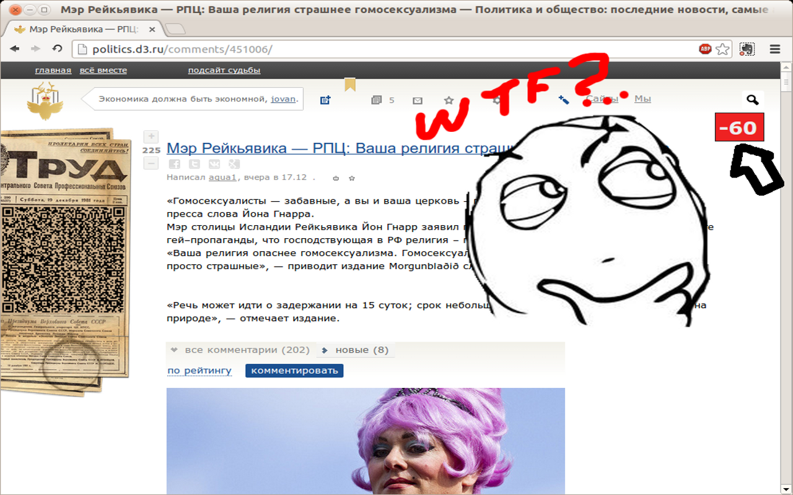
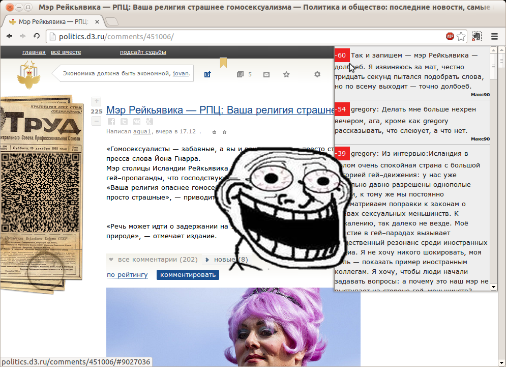

# Виджет ненависти для d3.ru. <small>0.0.1 βeta</small>

## Что умеет?

Показывает, сколько минусов набрал самый заминусованный комментарий статьи.

Показывает все заминусованные комментарии, начиная с самых-самых!

## Но зачем?

### Заминусованные комментарии - как правило, самые интересные либо оригинальные.

Часто в них озвучиваются вещи правильные, но неудобные для большинства людей. Потому их и минусуют. Большинство d3-юзеров чаще всего нифига не шарит в обсуждаемом предмете и имеет мышление, состоящее из набора навязанных им шаблонов. Нешаблонные комментарии обречены на гору минусов, но именно поэтому их интереснее всего читать.

Однако движок блога d3.ru стыдливо прячет ветки обсуждения с большим количеством минусов. Виджет ненависти эту проблему исправляет и самые сочные комменты выводит в собственный - злобный и альтернативный - топ.

## Чем же плохи заплюсованные комментарии?

Саморегулирующиеся сообщества устроены так, что больше положительных оценок набирают те высказывания, которые совпадают с мнением большего количества пользователей.

А, между прочим, из теории информации можно сделать заключение, что то, что и так известно большинству, несет меньше информации. И на эту гипотезу можно коварно натянуть вывод: то, что одобряется большинством - вероятнее всего будет уныло, неинтересно, банально. Как и само это большинство.